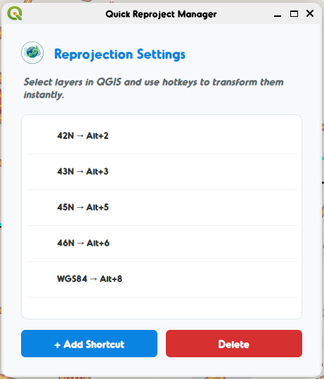
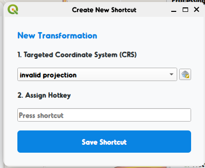
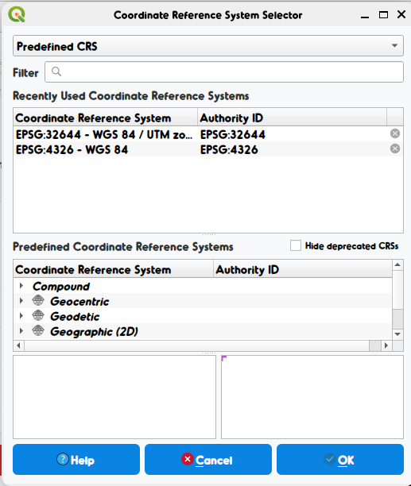

# 🔄 Quick Reproject


Part of the **[Ineffable Tools](https://github.com/ineffablexd)** suite.

**Quick Reproject ** is a high-performance QGIS plugin designed for GIS professionals who need to switch coordinate systems instantly. Map reprojecting and layer transformation have never been faster, thanks to customizable hotkeys and a streamlined workflow.

---

## 🖥️ Core Interface

<p align="center">
  
  
  
</p>

---

## ✨ Key Features

- ⚡ **Instant Reprojection:** Swap CRSs in milliseconds without opening nested menus.
- 🎹 **Custom Hotkeys:** Assign `Alt + Number` shortcuts for your most-used coordinate systems.
- 📦 **Batch Processing:** Select multiple layers and reproject them all at once.
- 🎨 **Modern UI:** A clean, intuitive management interface that fits into the Ineffable Tools ecosystem.
- 🌍 **Dual Engine Support:**
  - **Vector:** Uses high-speed memory layer processing.
  - **Raster:** Seamlessly integrates with GDAL Warp for pixel-perfect reprojection.
- 🇮🇳 **Localized Presets:** Built-in Indian UTM Zones (42N–46N) and WGS84 by default.

---

## 🛠️ Installation

1. **Option A: Manual Installation (Recommended)**
   - Clone this repository into your QGIS plugins folder:
     ```bash
     cd ~/.local/share/QGIS/QGIS3/profiles/default/python/plugins
     git clone https://github.com/ineffablexd/quick_reproject_plugin.git
     ```
2. **Option B: Zip Install**
   - Download the repository as a ZIP.
   - In QGIS, go to `Plugins` > `Manage and Install Plugins` > `Install from ZIP`.

Restart QGIS if the "Ineffable Tools" menu doesn't appear immediately.

---

## 🚀 How to Use

1. **Select Layers:** Highlight the layers you want to reproject in the QGIS Layer Tree.
2. **Use Hotkeys:** Press your assigned shortcut (e.g., `Alt+4` for UTM 44N) to transform them instantly.
3. **Manage Shortcuts:** Go to `Ineffable Tools` > `Quick Reproject` > `⚙ Manage Reprojection Shortcuts` to add or modify your CRS presets.
4. **Auto-Naming:** The plugin automatically adds a suffix (like `_44N`) to your new layers for easy identification.

---

## 👨‍💻 Author & License

- **Author:** [Vicky Sharma](mailto:vsharma@powergrid.in)
- **Email:** vsharma@powergrid.in
- **License:** Distributed under the **GPL-2.0-or-later** license.

---

<p align="center">
  Made with ❤️ by <b><a href="https://github.com/ineffablexd">Ineffable</a></b>
</p>
